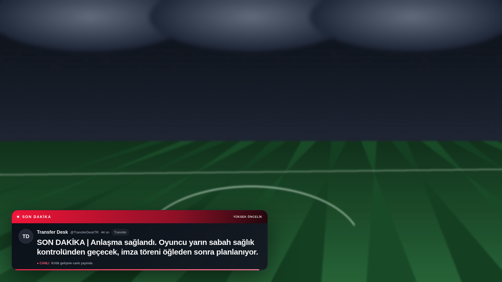
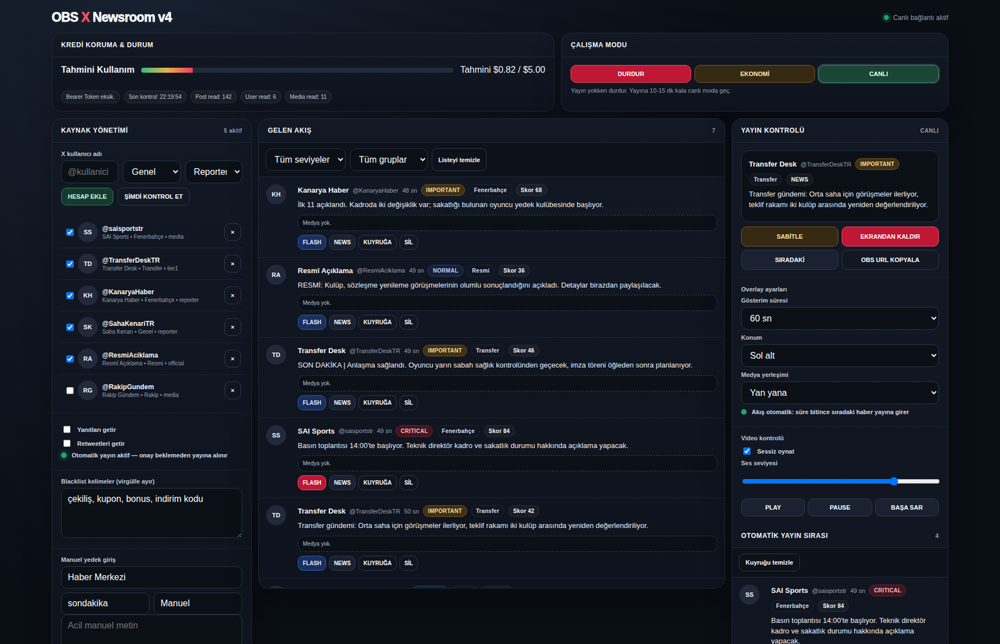
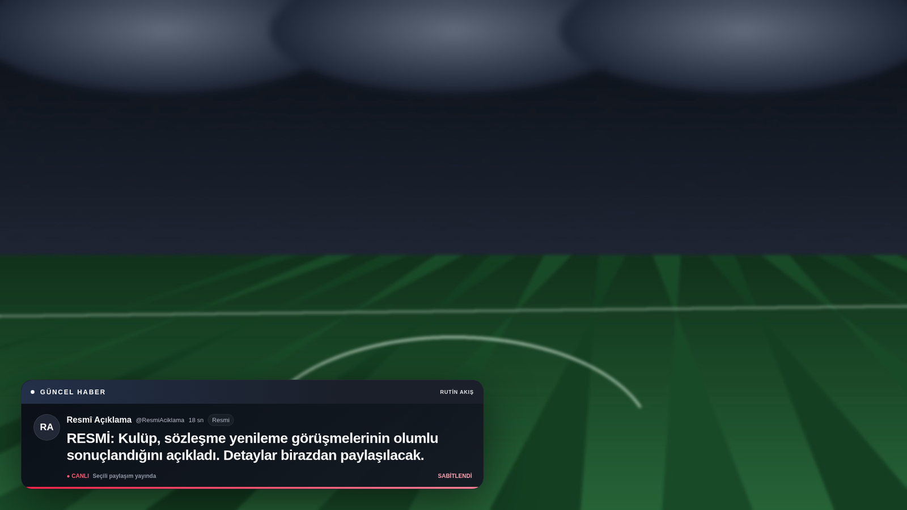
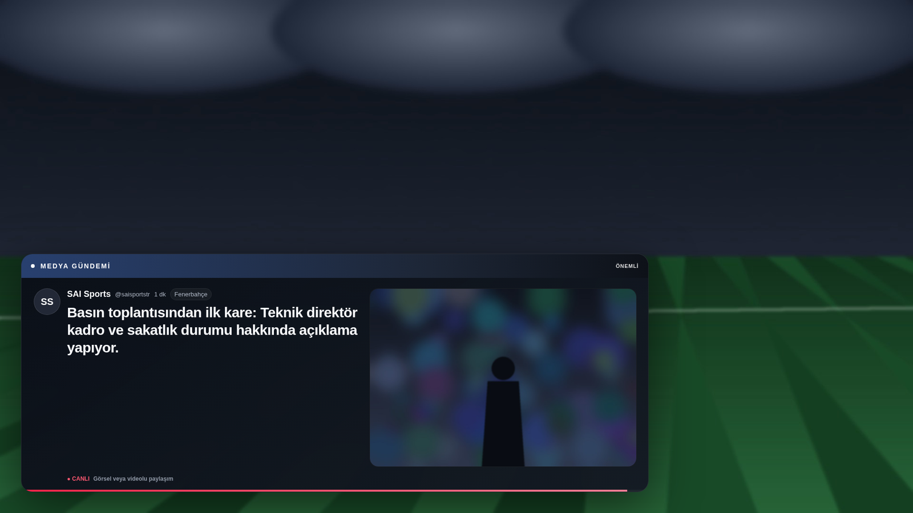

# ON-AIR NEWSROOM

**An automated breaking-news desk for live streams.** It watches the X (Twitter) accounts you trust, scores every incoming post, kills the duplicates and the spam, and pushes what matters straight onto your OBS scene as a broadcast-grade lower third — with no human clicking "approve" in the middle of a live show.

Built for Turkish football coverage ([@sergensahintr](https://x.com/sergensahintr)), but nothing in it is sport-specific: it works for any live stream that needs a fast, credible news ticker.

<p align="center">
  
</p>

<p align="center">
  
  
  
  
  
</p>

---

## The problem it solves

During a live broadcast, breaking news arrives faster than a solo streamer can react. The usual workflow — spot the tweet, alt-tab, screenshot it, crop it, drag it into the scene — costs 30–60 seconds and breaks the show's rhythm. By the time the graphic is up, the audience has already read it on their phone.

This project removes the human from the critical path:

```
X API  →  filter & score  →  deduplicate  →  auto on-air  →  OBS overlay
                 ↑                                  ↑
           blacklist, tiers                 pin / queue / next
```

A post can go from published to on-screen in a single polling cycle, while you keep talking.

---

## How it works

**1. Sourcing.** You register the accounts you trust in the control panel. Each one gets a **group** (General / Fenerbahçe / Transfer / Rival / Official) and a **tier** (`official`, `tier1`, `reporter`, `media`, `other`). Accounts are polled in batches through the X API v2 recent-search endpoint, using per-account cursors so the same post is never read twice.

**2. Scoring.** Every post gets a numeric score from three signals:

| Signal | Weight |
| --- | --- |
| Source tier | official 40 · tier1 30 · reporter 22 · media 14 · other 10 |
| Critical keywords (`son dakika`, `here we go`, `resmen`, `ilk 11`, `sakatlık`, …) | +18 each |
| Supporting keywords (`transfer`, `teklif`, `idman`, `lineup`, …) | +8 each |
| Has media, short & punchy text | +6 / +4 |

The score maps to a level: **CRITICAL** (≥75) · **IMPORTANT** (≥42) · **NORMAL**. Critical items open in the red `FLASH` template; everything else uses `NEWS`.

**3. Noise control.** Two filters run before anything reaches the screen:

- **Blacklist** — posts containing your banned words (giveaways, promo codes, betting spam) are dropped silently.
- **Deduplication** — incoming text is normalised (URLs, mentions and punctuation stripped) and compared with a Jaccard similarity test against recent items. A repeat doesn't create a second card; it *reinforces* the original one, bumping its score and recording every account that reported it. Ten journalists tweeting the same transfer becomes **one** card labelled with ten sources.

**4. Auto on-air.** This is the v4.1 behaviour: an approved post doesn't wait in an inbox for a click. If the screen is free, it goes live immediately. If a card is already showing, it joins the auto queue and airs when the current one expires. Hit **PIN** and the current card locks on screen while everything new stacks up behind it; unpin and the queue resumes on its own.

**5. Rendering.** The overlay is a transparent web page that OBS loads as a Browser Source. It receives state over WebSocket, so transitions are instant and there is no polling, no refresh, no flicker.

---

## Features

- **Three broadcast templates** — `FLASH` (critical, red), `NEWS` (standard), `MEDIA` (image/video layout)
- **Six anchor positions** for the card, plus side-by-side or stacked media layouts
- **Lazy media loading** — image and video details are only fetched from the API when you actually want to show them, so browsing the feed costs nothing
- **Native video playback** in the overlay with play / pause / restart / mute / volume control from the panel
- **Pin & queue** so a key story can hold the screen without losing what arrives behind it
- **Manual entry** — type a card by hand and send it straight to air when you're faster than the wire
- **Budget brake** — a local cost estimator that hard-stops polling before your X API credits run out
- **Three polling modes** — `PAUSED` (off-air), `ECONOMY` (120 s), `LIVE` (30 s)
- **Broadcast history** — an audit log of everything that went on air, got merged, or got pinned
- **Zero build step, 2 dependencies** (`ws`, `dotenv`), no database, no cloud service

---

## Screenshots

### Control panel — the newsroom desk

Sources on the left, the scored live feed in the middle, on-air control and the auto queue on the right. Credit usage and polling mode sit on top, always visible.



### `NEWS` template, pinned

A pinned card holds the screen indefinitely — the progress bar freezes and the footer shows `SABİTLENDİ` (pinned).



### `MEDIA` template

Photos and videos render beside the text, up to four attachments in a grid. Video posts autoplay with your chosen mute/volume state.



---

## Quick start

**Requirements:** Node.js 18+ and an X API bearer token with read access.

```bash
git clone https://github.com/sergio4848/onair-newsroom.git
cd onair-newsroom
npm install
cp .env.example .env      # then put your X_BEARER_TOKEN in it
npm start
```

Then open:

| | |
| --- | --- |
| Control panel | `http://127.0.0.1:8787/admin.html` |
| OBS overlay URL | `http://127.0.0.1:8787/overlay.html` |

On Windows, `START_WINDOWS.bat` does all of it in one double-click: it checks for Node, creates `.env` from the template on first run, installs dependencies, opens the panel and starts the server.

### OBS setup

1. Add a **Browser** source to your scene.
2. URL: `http://127.0.0.1:8787/overlay.html`
3. Width **1920**, Height **1080**, FPS 30–60.
4. Leave *Shutdown source when not visible* **off**, so the overlay stays connected between cards.
5. Custom CSS: leave empty — the page is already transparent.

The server binds to `127.0.0.1` only, so nothing is exposed outside your machine.

---

## Configuration

All settings live in `.env`:

| Variable | Default | What it does |
| --- | --- | --- |
| `PORT` | `8787` | HTTP + WebSocket port |
| `X_BEARER_TOKEN` | — | Your X API v2 bearer token (**required** for automatic sourcing) |
| `BUDGET_USD` | `5.00` | The credit budget the usage bar is drawn against |
| `STOP_AT_USD` | `4.50` | Hard stop — polling refuses to run past this estimate |
| `X_ACCOUNTS_PER_QUERY` | `8` | Accounts bundled into a single search query (1–10) |
| `X_MAX_RESULTS` | `25` | Posts requested per query |
| `LIVE_POLL_MS` | `30000` | Poll interval in LIVE mode (floor: 15 s) |
| `ECONOMY_POLL_MS` | `120000` | Poll interval in ECONOMY mode (floor: 30 s) |

### About the budget brake

The estimator counts what the app itself consumes — post reads, user lookups and media reads — and prices them locally (`$0.005 / $0.010 / $0.005` per read by default, editable in `server.js`). It is a **local safety rail, not a bill**: it is there to stop a forgotten LIVE-mode session from burning a month of quota overnight, and it should never be treated as X's authoritative billing figure. Usage is persisted in `data/usage.json` and can be reset from the panel.

---

## Control panel guide

| Section | What you do there |
| --- | --- |
| **Credit protection & status** | Estimated spend, last poll time, read counters, connection state |
| **Working mode** | `STOP` / `ECONOMY` / `LIVE` — switching to a polling mode resets cursors so you only get posts from now on |
| **Source management** | Add or remove accounts, set group and tier, toggle accounts on and off, edit the blacklist, send a manual card |
| **Incoming feed** | Every post with its score, level and group; filter by level or group; send any item to `FLASH`, `NEWS` or the queue |
| **On-air control** | What's showing now, pin / hide / next, card duration, screen position, media layout, video transport controls, the auto queue and the broadcast history |

> The interface language is **Turkish**, matching the newsroom it was built for. All identifiers, API fields and code comments are Latin-script and self-explanatory; translating the UI means editing the two files in `public/`.

---

## Under the hood

### HTTP endpoints

| Endpoint | Returns |
| --- | --- |
| `GET /api/state` | Full overlay state as JSON (what's on air, queue, inbox, settings) |
| `GET /api/health` | `{ ok, xConfigured, pollMode, tracked, estimatedUSD }` — handy for a stream-deck check |
| `GET /admin.html`, `GET /overlay.html` | The two pages, served from `public/` with path traversal blocked |

### WebSocket actions

Panel and overlay both connect to the same WebSocket. Every command is a JSON message, which makes the whole thing scriptable from a Stream Deck, a macro pad or another bot:

```js
const ws = new WebSocket("ws://127.0.0.1:8787");
ws.send(JSON.stringify({
  action: "show",
  template: "flash",                 // flash | news | media
  post: { name: "Newsroom", username: "sondakika", text: "BREAKING — ..." }
}));
```

| Action | Purpose |
| --- | --- |
| `show`, `enqueue`, `next`, `hide` | Move cards on and off the screen |
| `pin` | Lock the current card, hold everything behind it |
| `duration`, `position`, `media-layout` | Overlay presentation |
| `video-muted`, `video-volume`, `video-command` | Video transport (`play` / `pause` / `restart`) |
| `poll-mode`, `refresh-x` | Polling control and an immediate manual poll |
| `add-account`, `remove-account`, `toggle-account`, `tracking-options` | Source management |
| `manual-post`, `load-media`, `reset-usage`, `clear-inbox`, `clear-queue`, `clear-history` | Desk operations |

Every action broadcasts the new state to all connected clients, so the panel and the overlay can never drift apart.

### Project structure

```
onair-newsroom/
├── server.js            # polling, scoring, dedup, state machine, HTTP + WS server
├── public/
│   ├── admin.html       # control panel (self-contained, no build step)
│   └── overlay.html     # transparent OBS overlay (self-contained)
├── data/                # runtime state: tracked accounts, cursors, usage (git-ignored)
├── docs/screenshots/    # the images in this README
├── .env.example
└── START_WINDOWS.bat    # one-click launcher for Windows
```

---

## Notes & limitations

- The X API is a paid product. Without a bearer token the app still runs fully — panel, overlay, templates, manual cards — it simply won't source anything automatically.
- Keyword scoring is tuned for **Turkish** football vocabulary. The two keyword arrays at the top of `server.js` are the first thing to edit for another language or beat.
- State lives in flat JSON files under `data/`. That is deliberate: no database, no migrations, nothing to babysit ten minutes before going live.
- Screenshots in this README are real captures of the running app; the posts in them are fictional demo content created for the screenshots.

---

## License

MIT — see [LICENSE](LICENSE).

Built by **Sergen Şahin** — [S-AI](https://saimediaworks.com.tr) · [@saisportstr](https://x.com/saisportstr)
